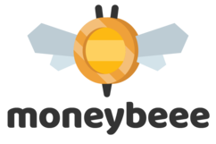

# hackumbc2018-moneybeee

Peer to Peer currency exchange. Web platform powered by NodeJS + Express that helps users save money and exchange foreign currencies freely without any hidden charges or hassel. Is mobile responsive and uses modern web accessibility techniques to make it available to as many people as possible.

# Try it!
Take a look at our Beta web app [HERE!](http://www.moneybeee.com/)
